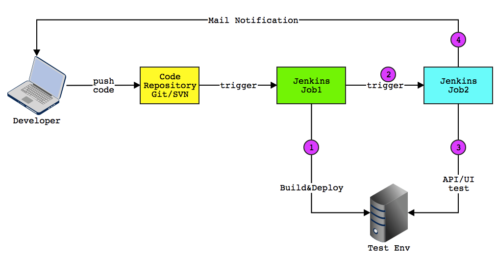

# jenkins-remote-trigger

Trigger remote Jenkins job in Jenkins command shell.

## Background

Suppose you have two Jenkins jobs. The first job mainly targets for building and deploying, and the second job is related to integration test, such as API test or UI test.



In some cases, these two jobs can not be executed on the same machine. For instance, the build is related to `Windows` platform, while the test can only run on `Linux` platform. As a consequence, we have to configure two jobs to do respective works.

Although we can configure `Build other projects` in Jenkins job, thus the second job can be triggered after the former job finished. However in this case, even if the latter job failed, the former job will still be marked as success and its status can not be changed. That's not what we want.

We want the running status of the former Jenkins job not only depend on its own build, but also depend on the latter build result.

And that is the origin aim of this project.

## Solution

The solution is simple.

In the post part of the former job's shell execution, we can trigger another Jenkins job remotely, block until remote build finished, and get its build result to determine if we should fail the current job.

To achieve this goal, we need to access resources and handle with remote Jenkins server, and the [pycontribs/jenkinsapi][jenkinsapi] library will be of great help.

## Usage

In the former Jenkins job configuration, we can add the following bash scripts to the tail of shell scripts.

```bash
# do the work of current job

# then execute the following scripts
rm -rf jenkins-remote-trigger
git clone https://github.com/debugtalk/jenkins-remote-trigger.git
cd jenkins-remote-trigger
pip install -r requirements.txt
python jenkins_remote_trigger.py \
    --host http://192.168.0.169:8080 \
    --username api-user \
    --password api-passwd \
    --job-name Prj-SmokeTest \
    --mail-recepients ${MAIL_RECEPIENTS}
```

## Limitation Notice

This solution has a limitation: the triggered job can not be on the same node with the current job.

Because the first job will block until the second job finished, while the second job can only be started to build after the former job ends if they are on the same node, which leads to a dead lock.


[jenkinsapi]: https://github.com/pycontribs/jenkinsapi
